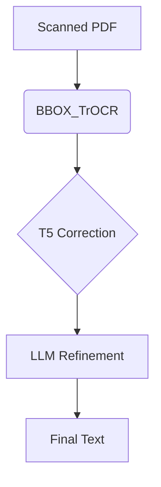

# RenAIssance OCR Pipeline for Historical Spanish Texts
NOTE: I HAVE ALSO ADDED A SHORT PDF REPORT FOR BETTER UNDERSTANDING
Author: Kulkarni Pranav Pradeeprao 
Indian Institute of Technology, Bombay (Mumbai, Maharashtra, India)
Contact: pranavesque@gmail.com | 22b0642@iitb.ac.in 


An end-to-end system for recognizing and correcting text in early modern printed documents, combining computer vision and language models.

## 📂 Code Files Overview

### 1. `BBOX_TrOCR.ipynb` - Core OCR Pipeline
**Function**:
- Text detection & line segmentation
- Spanish TrOCR inference
- Text reconstruction

**Key Features**:
```python
def detect_text_components():
    # Thresholding + connected components analysis
    # Hierarchical line clustering (y-axis grouping)

def process_with_trocr():
    # Batch processing with qantev/trocr-large-spanish
    # Confidence-based error filtering
```

### 2. `rodrigo-dataset-ft-demo.ipynb` - Model Fine-Tuning
**Function**:
- Memory-optimized TrOCR training
- Dataset: 17th-century Spanish texts


### 3. `CORRECTIONS_LLM.ipynb` - Semantic Correction
**Function**:
- Post-OCR refinement using Gemini Pro
- Error analysis with diffing

**Metrics Improvement**:
| Metric | Before | After |
|--------|--------|-------|
| CER    | 34.75% |  5.69%|
| BLEU   | 0.2497 | 0.6353 |

### 4. `Creating_images_for_FT.ipynb` - Data Generation
**Function**:
- Synthetic training data creation
- Tesseract-based word extraction

**Challenges**:
```python
# Word-level extraction limitations:
- Isolated words vs TrOCR's sequence modeling
- Ground truth alignment issues
```

### 5. `finetune-attempt-for-t5-base-spanish.ipynb` - Spelling Correction
**Function**:
- T5 model for OCR error correction
- Synthetic error generation

**Innovations**:
```python
class WordLevelCorrector:
    # Context-aware correction (3-word window)
    # Whitespace-preserving reconstruction
```


## 🔄 Workflow


## 📊 Performance
| Model        | CER   | WER   | BLEU  |
|-------------|-------|-------|-------|
| My pipeline | **5.69%**  | **17.67%**  | **0.6353** |
| EasyOCR     | 18.92% | 51.97% | 0.2517 |
| PyTesseract | 11.33% | 57.48% | 0.3049 |


## 📝 Usage Example
```python
# Full pipeline execution
result_image, ocr_results = run_complete_ocr_pipeline(
    "historical_page.jpg",
    output_dir="results",
    model_name='fine-tuned-trocr'
)

# LLM correction
corrected = gemini_correct(ocr_results)
```

## 🚧 Limitations & Future Work
- **Line Segmentation**: Struggles with multi-column layouts
- **Memory**: Fine-tuning requires GPU optimization
- **Context**: Limited document-level understanding

## Metrics Used
| Metric            | What It Captures            | What It Misses         |
|------------------|---------------------------|------------------------|
| CER             | Character-level precision  | Semantic meaning      |
| WER             | Word usability             | Long-word fairness    |
| BLEU            | Phrase structure           | Synonymy/paraphrase   |
| Cosine Similarity | Semantic equivalence      | Surface-form errors   |


---

